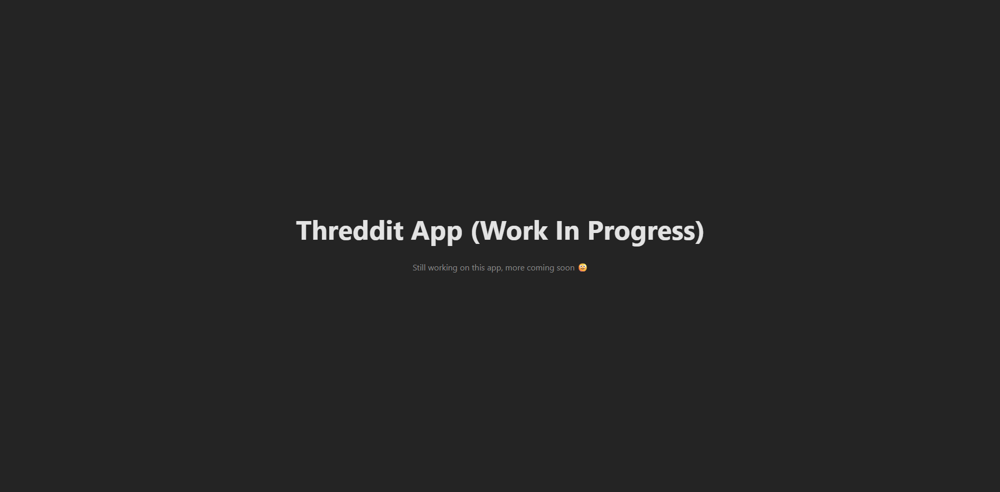

<h1>Threddit App</h1>
<h4><!-- Description --></h4>

<h3>
  <a href="https://threddit-app.vercel.app">Live Preview</a>
</h3>

<h2>Features</h2>

- <h4><!-- Feature 1 --></h4>
- <h4><!-- Feature 2 --></h4>
- <h4><!-- Feature 3 --></h4>
- <h4><!-- Feature 4 --></h4>
- <h4><!-- Feature 5 --></h4>

<h2>Technologies</h2>

<h2>Screenshots</h2>
<!--

-->